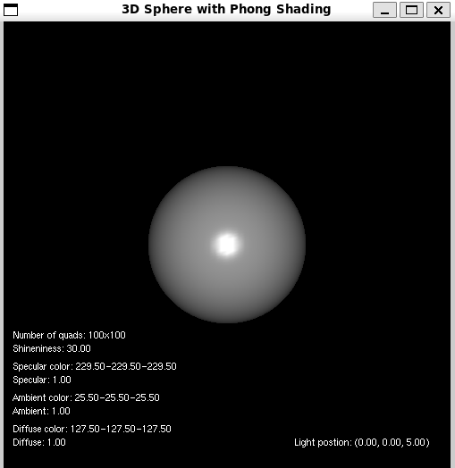
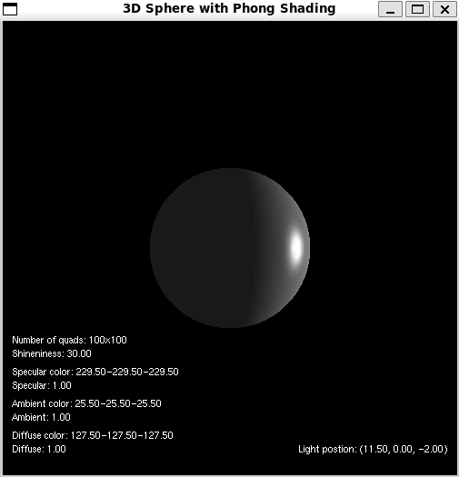
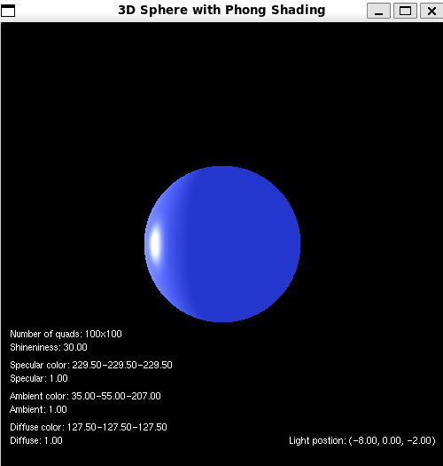

# Phong Shading Simulation

This project demonstrates the implementation of Phong shading. The simulation displays a shaded sphere that can be interactively manipulated to observe the effects of different lighting and material properties.
 

## Features

- Real-time Phong shading effects.
- Interactive controls to modify lighting and material properties such as diffuse, specular, and ambient components.
- Adjustable light position using keyboard controls.
- Rotation of scene along y axis for visualisation of algorithm effects. 
- Resettable rotation for quick orientation resets.
- Observer is static and in point (0,0,5) and center of sphere is always in point (0,0,0)
 

## Required Libraries and Packages

1. **GLUT (OpenGL Utility Toolkit)**:
   - Provides functionality for handling windowing, input, and other tasks in OpenGL.
   - Install GLUT using:
     ```
     sudo apt-get install freeglut3 freeglut3-dev
     ```

2. **OpenGL Libraries**:
   - Essential libraries for OpenGL projects.
   - Install with:
     ```
     sudo apt-get install libglu1-mesa libglu1-mesa-dev
     ```

3. **GLFW (Graphics Library Framework)**:
   - Manages OpenGL contexts, windowing, and inputs.
   - Install GLFW using:
     ```
     sudo apt-get install libglfw3 libglfw3-dev
     ```

4. **GLEW (OpenGL Extension Wrangler Library)**:
   - Manages OpenGL extensions across different platforms.
   - Install GLEW with:
     ```
     sudo apt-get install libglew-dev
     ```

5. **pthread**:
   - Provides multithreading support.
   - Usually included in the system, but for development headers, install with:
     ```
     sudo apt-get install libpthread-stubs0-dev
     ```

6. **GCC/G++ Compiler**:
   - Necessary to compile the project.
   - Install G++ compiler with:
     ```
     sudo apt-get install build-essential
     ```

## Building the Project with Makefile

To build this project, use the command **make** in the project directory.

This will compile the source files and link the required libraries into an executable named `sphere`. To clean the build, use **make clean**.

## Running the Simulation

After building the project, you can run the simulation by executing **./sphere**.

## Controls

- **Arrow Keys**: Move the light source in X and Y directions.
- **C and V**: Move the light source closer or further away in the Z direction.
- **Q, A**: Increase or decrease the diffuse component.
- **W, S**: Increase or decrease the ambient component.
- **E, D**: Increase or decrease the specular component.
- **R, F**: Increase or decrease the shininess exponent.
- **T, G**: Increase or decrease the number of slices and stacks on the sphere.
- **Z, X**: Rotate the scene left or right.
- **Space**: Reset the rotation of the sphere to the initial orientation.

While the application is running, it listens for input in the terminal window. You can update the material properties by following these steps:

1. Focus on the terminal window where the application is running.
2. Input the property you wish to change: `diffuse`, `specular`, or `ambient`.
3. Provide the RGB values for the property. These values should be specified in the range of 0 to 255.

- **diffuse r g b**: Updates the diffuse color of the material.
- **specular r g b**: Updates the specular color of the material.
- **ambient r g b**: Updates the ambient color of the material.
Please ensure that the RGB values are within the correct range to avoid runtime errors. The application does not handle out-of-range values and will prompt for re-entry if the provided values are not valid.

The application utilizes **pthreads** for handling asynchronous input in the terminal. This approach allows the OpenGL context to remain responsive and redraw the scene with updated material properties as soon as changes are made.

Ensure that your system supports pthreads and that it is correctly configured to compile with pthread support as described in the installation section.

 

## Contributing

Contributions to this project are welcome. Please fork the repository and submit pull requests with any enhancements or bug fixes.

