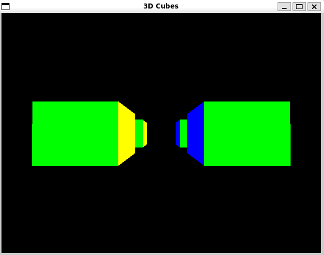
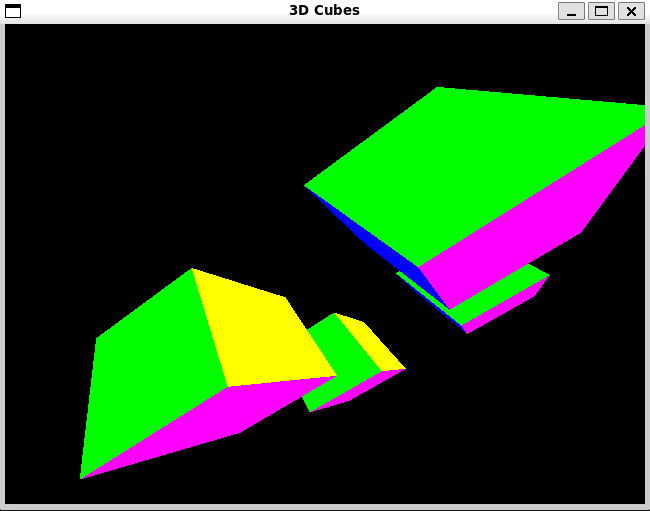

# 3D Virtual Camera Project with visible surface determination

This project demonstrates a 3D virtual camera system with visible surface determination that allows you to interact with and transform 3D objects in a virtual space. Camera system is that the observer is always located at the origin point (0,0,0), and transformations are applied to objects in the opposite direction of the intended camera movement or rotation thus creting inlusion of movement. Project implentes nessecary transformations and matrix operation. \
 


## Painter's Algorithm for Visible Surface Determination

The Painter's Algorithm, also known as the priority fill algorithm, is implemented in this application to handle visible surface determination. This algorithm is particularly useful in rendering scenes where the depth of each element within the scene needs to be correctly represented from a specific viewpoint.

### Implementation Details

The Painter's Algorithm works by sorting all the graphical elements based on their depth relative to the observer, with the farthest elements being drawn first and the closest elements drawn last. This ensures that closer objects naturally cover the parts of farther objects, mimicking the way objects block each other in the real world.

In this application, each cube's faces are splited into polygons and are sorted before being rendered. The sorting is based on the z-coordinate of each face's center, which determines its depth in the scene.

### Limitations
However, the Painter's Algorithm can face challenges such as sorting errors in complex scenes with interpenetrating objects or when handling translucent materials. For more complex or dynamic scenes, more advanced techniques like Z-buffering might be preferred for depth computation.

This implementation highlights how classic rendering techniques are adapted to modern OpenGL projects to achieve realistic 3D visualizations.

## Code Structure
- **Main Application (`main.cpp`)**: Initializes the GLFW window, sets up key callbacks, and enters the main rendering loop where it continuously checks for user input and renders the scene.
- **Cube Class (`cube.h`, `cube.cpp`)**: Defines the `Cube` class which includes the vertices of the cube and the constructor to initialize a cube with a specific center and edge length.
- **Transformations (`transformations.h`, `transformations.cpp`)**: Contains the `TransformationManager` class that implements transofrmations


## Required Libraries and Installation

To compile and run this project, several libraries related to OpenGL are required. Below are the necessary libraries along with installation instructions for a Linux-based system:

1. **OpenGL Libraries**:
   - Essential for rendering 3D graphics. You'll need both GL (Graphics Library) and GLU (OpenGL Utility Library).
   - Install these libraries using:
     ```
     sudo apt-get install libglu1-mesa libglu1-mesa-dev
     ```

2. **GLFW (Graphics Library Framework)**:
   - Manages window creation, context management, and handles user input. Necessary for creating and managing windows in which your 3D scenes are rendered.
   - Install GLFW with the following command:
     ```
     sudo apt-get install libglfw3 libglfw3-dev
     ```

3. **Math Library (libm)**:
   - While usually included with standard compilers, ensure your environment includes it for handling mathematical operations not directly handled by OpenGL.
   - Typically no installation is required, as it should be available by default.


## Building the Project with Makefile

To build this project, use the command **make** in the project directory.

This will compile the source files and link the required libraries into an executable named `camer3D`. To clean the build, use **make clean**.

## Running the Simulation

After building the project, you can run the simulation by executing **./camer3D**.

## Perspective Projection

The manual perspective projection matrix used to define the viewing frustum is defined as follows, given the field of view angle \(fov\), aspect ratio \(aspect\), and near and far clipping planes \(near\) and \(far\):

```math

\text{Perspective Matrix} = 
\begin{bmatrix}
\frac{1}{\tan\left(\frac{fov}{2}\right) \cdot aspect} & 0 & 0 & 0 \\
0 & \frac{1}{\tan\left(\frac{fov}{2}\right)} & 0 & 0 \\
0 & 0 & \frac{far + near}{near - far} & \frac{2 \cdot far \cdot near}{near - far} \\
0 & 0 & -1 & 0
\end{bmatrix}

```

This matrix helps transform 3D points into a 2D perspective projection.

## Transformations 
 
### Translations

Translations in this application involve shifting objects within the scene based on user input to simulate camera movements. Each translation alters the position of objects in 3D space along the x, y, and z axes.

- **Move Right/Left**:
  - Moving right (simulating camera moving left):
  
    ```math
    \begin{bmatrix}
    1 & 0 & 0 & -0.05 \\
    0 & 1 & 0 & 0 \\
    0 & 0 & 1 & 0 \\
    0 & 0 & 0 & 1 
    \end{bmatrix}
    ```
  - Moving left (simulating camera moving right):
  
    ```math
    \begin{bmatrix}
    1 & 0 & 0 & 0.05 \\
    0 & 1 & 0 & 0 \\
    0 & 0 & 1 & 0 \\
    0 & 0 & 0 & 1 
    \end{bmatrix}
    ```

- **Move Up/Down**:
  - Moving up (simulating camera moving down):
  
    ```math
    \begin{bmatrix}
    1 & 0 & 0 & 0 \\
    0 & 1 & 0 & -0.05 \\
    0 & 0 & 1 & 0 \\
    0 & 0 & 0 & 1 
    \end{bmatrix}
    ```

  - Moving down (simulating camera moving up):
  
    ```math
    \begin{bmatrix}
    1 & 0 & 0 & 0 \\
    0 & 1 & 0 & 0.05 \\
    0 & 0 & 1 & 0 \\
    0 & 0 & 0 & 1 
    \end{bmatrix}
    ```

- **Move Forward/Backward**:
  - Moving forward (simulating camera moving backward):
  
    ```math
    \begin{bmatrix}
    1 & 0 & 0 & 0 \\
    0 & 1 & 0 & 0 \\
    0 & 0 & 1 & 0.05 \\
    0 & 0 & 0 & 1 
    \end{bmatrix}
    ```

  - Moving backward (simulating camera moving forward):

    ```math
    \begin{bmatrix}
    1 & 0 & 0 & 0 \\
    0 & 1 & 0 & 0 \\
    0 & 0 & 1 & -0.05 \\
    0 & 0 & 0 & 1 
    \end{bmatrix}
    ```

### Rotations

Rotations are performed using quaternions to avoid the gimbal lock problem and ensure smooth rotational transitions. Rotations are applied around the X, Y, and Z axes based on user inputs:

- **Rotate around X-axis**: Triggered by cursor position along the Y-axis.
- **Rotate around Y-axis**: Triggered by cursor position along the X-axis.
- **Rotate around Z-axis**: Triggered by pressing "A" (counter-clockwise) and "D" (clockwise).

Each rotation applies a quaternion transformation based on an axis-angle representation:


```math
q = \cos\left(\frac{\theta}{2}\right) + \sin\left(\frac{\theta}{2}\right) \cdot (ix + jy + kz) 
```
Formula:

```math
\vec{v}' = q \cdot \vec{v} \cdot q^*
```

### Scaling

Scaling operations adjust the size of objects relative to a center point (typically the origin) to simulate zooming in and out:

- **Zoom In/Out**: Adjusts the scale of all objects using a uniform scaling matrix:

  ```math
  \begin{bmatrix}
  s & 0 & 0 & 0 \\
  0 & s & 0 & 0 \\
  0 & 0 & s & 0 \\
  0 & 0 & 0 & 1
  \end{bmatrix}
  ```
### Data Structures

- **Matrix4x4**: Represents transformation matrices with 16 elements. Supports matrix-vector multiplication which applies the transformation to a 3D point:
  ```math
  \vec{v}' = \text{Matrix} \cdot \vec{v}
  ```
  Where {v} is a vector in homogeneous coordinates.

- **Quaternion**: Represents rotations in 3D space using four components (w, x, y, z). Quaternions are used for their computational efficiency and to avoid the issues of gimbal lock that can occur with Euler angles.


## Control Functions Description
The control functions handle user inputs to transform objects within the 3D scene. These transformations are applied in response to keyboard and mouse inputs, which are mapped to specific actions like movement and rotation.

### Key Bindings

- **Arrow Keys (Right/Left/Up/Down)**: Moves the cubes right, left, up, and down. This is achieved by applying the opposite movement to the cubes, simulating camera movement in the intended direction.
- **W and S**: Moves the cubes forward and backward.
- **A and D**: Rotates the cubes around the Z-axis. `A` rotates left (counter-clockwise), and `D` rotates right (clockwise).
- **Mouse Position**:
  - Horizontal Position: Rotates the cubes around the Y-axis based on the cursor's x-position.
  - Vertical Position: Rotates the cubes around the X-axis based on the cursor's y-position.
  
The rotations and translations are triggered only if the cursor is inside the GLFW window.

### Special Keys for Zooming

- **I**: Zooms in on the cubes by increasing their size relative to the zoom center.
- **O**: Zooms out by decreasing their size.
